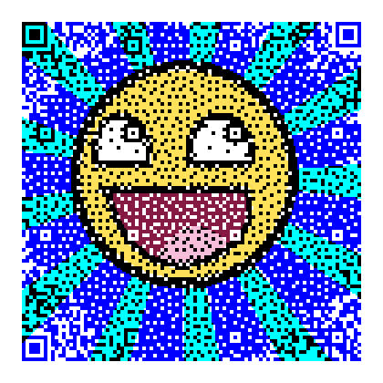

\[click on image to jump to the converter\]  
[](https://QRpicture.com)

# qrpicture

Create photo and colour QR codes, hosted on [https://QRpicture.com](https://QRpicture.com)

Instead of an ad with tracking...  
Like to [donate ](https://opencollective.com/QRpicture) some appreciation for the use or inspiration this gives you?

### Welcome to the Wonderful World of photo and colour QR's

Features:
*   93x93 pixel QR code capable of holding 100 characters.
*   The size also makes the scanning responsive and fast.
*   186x186 pixel colour information.
*   Colours are chosen from a high-contrast QR-safe palette.
*   Dithering introduces blurring which reduces sharp contrast edges.
*   Repository hosted on [https://QRpicture.com](https://QRpicture.com).
    
Creating photo QR's is a two-part process.

First part (`qrcode`) is to create a 93x93 pixel dithered monochrome image overlaid with mandatory QR pixels. 
The applied dithering performs a best match to ensure the CRC is fully compliant. 

The second part (`qrscq`) is to create a 186x186 pixel dithered color image.
The colour palette is created using Spacial Colour Quantification.

Both parts use the same SCQ dithering mechanism to maximize shades and perception to give the result a natural effect.

## Scalable mobile friendly html/css user interface

The UI design is highly responsive and scales dynamically to screen size and aspect ratio.
The intention is to have a single page interface optimally utilize to the screen using a single layout for both mobile and desktop.

The only units used are `"%"` which is the percentage of the containing bounding box or `"em"` which is the current font size.
This makes ALL elements/borders/spacing scale to a single base value `"document.body.fontSize"`.

The general layout if constructed from the screen edges going inward using `"position:absolute"` and `"%"` as units.
Section contents are constructed inwards going outwards using `"position:relative"` and `"em"` as units.

## Requirements

*   LAMP environment
*   libgd graphical library
*   GD-enabled php
*   MooTools for DOM/JavaScript connectivity

## Installation

You can create the autoconf framework with the script `autogen.sh` if `configure` is missing.
Otherwise, the GitHub release section will have a framework enabled bundle `https://github.com/xyzzy/qrpicture/releases/`.
 
Configure and set prefix to document root

```sh
  ./configure --prefix=<documentroot>
```

Build qrcode/qrscq

```sh
  make
```

Create database and load tables

```sh
  mysql < qrpicture.sql
  edit config.php
  make "image" directory writable for http server
```

Install site

```sh
  make install
```

Start background workers.
I suggest one worker per CPU core.

```sh
  nohup worker.sh >/var/log/httpd/worker1.out 2>>/var/log/httpd/worker1.err&
```
	
## Source code

Grab one of the tarballs at [https://github.com/xyzzy/smile/releases](https://github.com/xyzzy/smile/releases) or checkout the latest code:

```sh
  git clone https://github.com/xyzzy/qrpicture.git
```

## Versioning

Using [SemVer](http://semver.org/) for versioning. For the versions available, see the [tags on this repository](https://github.com/xyzzy/qrpicture/tags).

## License

This project is licensed under the GNU AFFERO General Public License v3 - see the [LICENSE.txt](LICENSE.txt) file for details

## Acknowledgments

* Masahiro Hara and his work on setting the QR code standard.
* Irving S. Reed and Gustave Solomon for their work on "Reed-Solomon ECC".
* Derrick Coetzee and his amazing work on Spatial Colour Quantization.
* Donald Meagher and his work on octrees for colour quantization.
